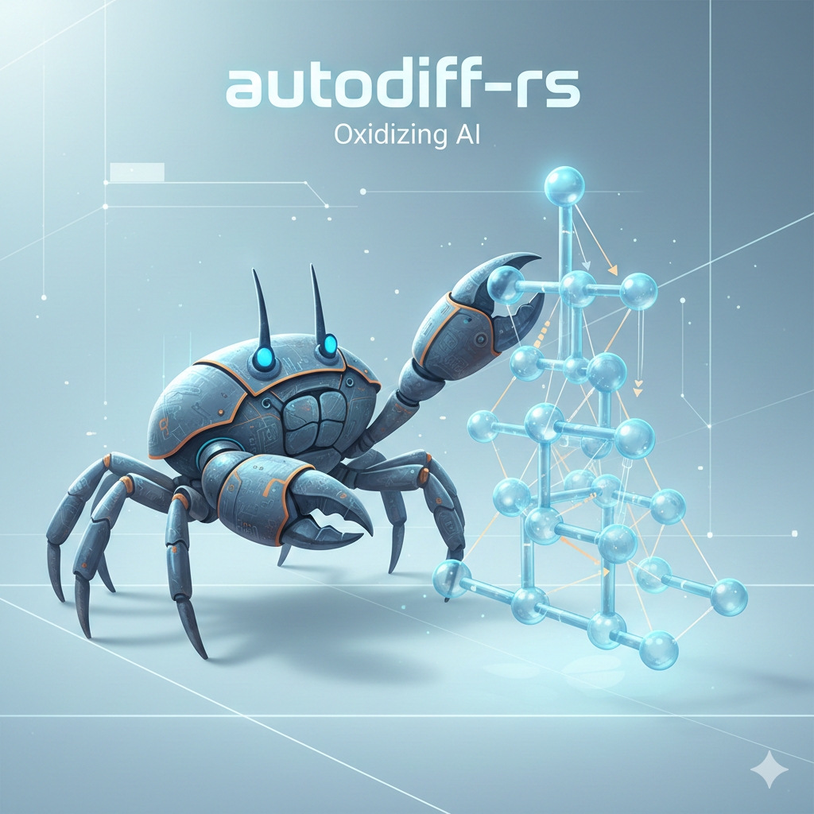

# autodiff-rs

<p align="center">
  
</p>

A technical exploration of scalar automatic differentiation in Rust. Inspired by Andrej Karpathy's `micrograd`, this project "oxidizes" the concept, leveraging Rust’s strict ownership model to build a memory-safe computational graph.

> [!IMPORTANT] > **This is a learning project.** It prioritizes architectural clarity and mathematical transparency over raw performance. It is designed to serve as a technical manual for understanding how backpropagation is implemented at the engine level.

---

## 🏗️ Architectural Specification

### 1. The Computational Graph (DAG)

The engine represents mathematical expressions as a **Directed Acyclic Graph (DAG)**. Every scalar value is a node that stores:

- **Data**: The raw `f64` value.
- **Gradient**: The accumulated partial derivative $\frac{\partial Loss}{\partial Value}$.
- **Operation Metadata**: The operation that produced the node (for visualization).
- **Lineage**: Pointers to the parent nodes that generated it.

### 2. Memory Management: The `Rc<RefCell<Data>>` Pattern

Unlike Python's dynamic garbage collection, Rust requires explicit ownership management. This project utilizes the **Interior Mutability Pattern**:

- **`Rc` (Reference Counting)**: Allows multiple nodes to share ownership of a single input.
- **`RefCell`**: Enables the mutation of gradients during the backward pass even when nodes are held via shared immutable references.

### 3. Reverse-Mode Autodiff

The library implements the **Multivariate Chain Rule** through a three-step process:

1.  **Forward Pass**: Compute output values and construct the graph dynamically.
2.  **Topological Sort**: Sort the graph to ensure that for any node, all its "users" are processed before it. This ensures the full gradient is accumulated before being passed backward.
3.  **Backward Pass**: Iterate through the sorted nodes in reverse, invoking stored closures to propagate gradients.

---

## 🛠️ Technical Manual: Core Components

### Supported Operators

| Operator           | Mathematical Form           | Local Derivative ($\frac{\partial out}{\partial in}$) |
| :----------------- | :-------------------------- | :---------------------------------------------------- |
| **Addition**       | $a + b$                     | $1$                                                   |
| **Multiplication** | $a \cdot b$                 | $b$ (w.r.t $a$), $a$ (w.r.t $b$)                      |
| **Power**          | $x^n$                       | $n \cdot x^{n-1}$                                     |
| **ReLU**           | $\max(0, x)$                | $1$ if $x > 0$, else $0$                              |
| **Tanh**           | $\frac{e^{2x}-1}{e^{2x}+1}$ | $1 - \tanh^2(x)$                                      |
| **Exp/Log**        | $e^x, \ln(x)$               | $e^x, \frac{1}{x}$                                    |

### Neural Network Module (`nn.rs`)

A modular stack built on top of the engine:

- **`Neuron`**: A single unit with weights $w$ and bias $b$.
- **`Layer`**: A collection of neurons.
- **`MLP` (Multi-Layer Perceptron)**: A fully connected feed-forward network.
- **`SGD`**: A basic Stochastic Gradient Descent optimizer.

### Visualization (`visualizer.rs`)

Powered by **egui**, the project can render the live computational graph. This is invaluable for debugging gradient flow and visualizing how the chain rule propagates through nested functions.

---

## 🔬 Verification & Testing

To ensure the integrity of the analytical gradients, the project implements **Numerical Gradient Checking** verified using the finite-difference approximation:

$$f'(x) \approx \frac{f(x + h) - f(x - h)}{2h}$$

We verify that our backpropagation results match the numerical gradients within a tolerance of $10^{-4}$.

---

## 🚀 Quick Start

```rust
use autodiff_rs::engine::Value;

fn main() {
    let x1 = Value::new(2.0);
    let x2 = Value::new(0.0);
    let w1 = Value::new(-3.0);
    let w2 = Value::new(1.0);
    let b = Value::new(6.7);

    // Build the graph
    let x1w1 = &x1 * &w1;
    let x2w2 = &x2 * &w2;
    let out = (&x1w1 + &x2w2) + &b;
    let loss = out.tanh();

    // Backpropagate
    loss.backward();

    // Visualize (opens an egui window)
    loss.draw();
}
```
